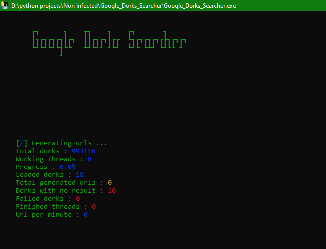

# Google Dorks Searcher

<p align="center">
  <pre style="color: #00FF00; background-color: #000000;">
        ┏┓      ┓    ┳┓    ┓    ┏┓       ┓     
        ┃┓┏┓┏┓┏┓┃┏┓  ┃┃┏┓┏┓┃┏┏  ┗┓┏┓┏┓┏┓┏┣┓┏┓┏┓
        ┗┛┗┛┗┛┗┫┗┗   ┻┛┗┛┛ ┛┗┛  ┗┛┗ ┗┻┛ ┗┛┗┗ ┛ 
               ┛                               
  </pre>
<p>

## Overview

**Google Dorks Searcher** is a powerful tool for automating the search of Google dorks. It utilizes multi-threading to perform searches efficiently and can be executed either from the source code or as a standalone executable. This tool allows users to specify dork files and the number of threads, making it highly customizable and efficient.

## Features

- **Multi-Threaded Searches:** Performs searches quickly using multiple threads.
- **Customizable Input:** Allows users to specify the path for dork files and the number of threads.
- **Organized Output:** Results are stored in the `result` folder, which must not be deleted.
- **Error Handling:** Dorks that fail to return results are saved in the `failed_dorks` folder.
- **No reCAPTCHA:** Searches are conducted without triggering reCAPTCHA challenges.
- **Executable Version:** Available as a Python script and a standalone executable for convenience.

## Installation

### From Source Code

1. Clone the repository:

   ```bash
   git clone https://github.com/AbidAbed/Google-Dorks-Searcher.git
   cd google-dorks-searcher
   ```

2. Install the required dependencies:

   ```bash
   pip install -r requirements.txt
   ```

3. Run the script:

   ```bash
   python Google_Dorks_Searcher.py
   ```

### Executable Version
   Alternatively, you can use the x64 zip file for your platform.

1. Unzip the `Google_Dorks_Searcher_x64.zip` file if necessary and run the executable:

   ```bash
   Google_Dorks_Searcher.exe
   ```


## Usage

1. **Prepare Dork Files:** Place your dork queries in text files within a folder.

2. **Run the Tool:** 
   - If using the Python script, execute it via the command line.
   - If using the executable, run it and follow the prompts.

3. **Check Results:** Results will be saved in the `result` folder, and any failed dorks will be logged in the `failed_dorks` folder.

## Example Directory Structure

```plaintext
/google-dorks-searcher
│
├── dork_files/
│   ├── dork1.txt
│   ├── dork2.txt
│   └── ...
│
├── result/
│   ├── dork1_results.txt
│   ├── dork2_results.txt
│   └── ...
│
├── failed_dorks/
│   └── failed_dork1.txt
│
├── Google_Dorks_Searcher.py
├── Google_Dorks_Searcher.exe
└── requirements.txt
```

## Contributing

Contributions are welcome! If you find any issues or have suggestions for improvements, please open an issue or submit a pull request.

## License

This project is licensed under the MIT License. See the `LICENSE` file for more details.

## Acknowledgments

Thank you to all contributors and the open-source community for their support.

## Example running

<p align="center">
  
</p>